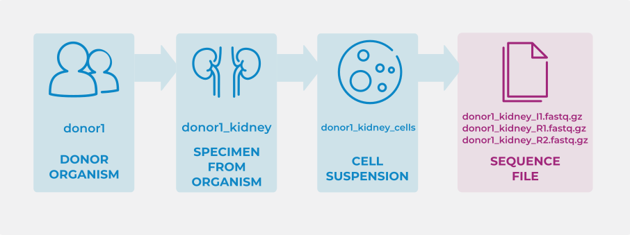

Google Sheets and Excel spreadsheets are used to gather metadata about
your project. This document is a brief walkthrough to help you get
started filling out an HCA metadata spreadsheet.

If you have any questions at any stage while filling out the
spreadsheet, please contact the data wrangling team at:  
[`wrangler-team@data.humancellatlas.org`](mailto:wrangler-team@data.humancellatlas.org).

## Before you start

Metadata is represented in a spreadsheet with tabs that relate to the
experimental design. For example, an `Organoid` tab would be included if
an experiment includes organoid samples, whereas a `Donor organism` tab 
would be included if your experiment derived from a Donor. If you think 
your spreadsheet is missing fields or tabs to properly describe your 
experiment, please contact a data wrangler at 
[`wrangler-team@data.humancellatlas.org`](mailto:wrangler-team@data.humancellatlas.org).

## Spreadsheet tab organization

Metadata is collected for each component of your experiment, for example: project, donor,
sequence file, and dissociation protocol. We refer to each component as an **entity**. 
Each of these **entities** has a separate tab in the spreadsheet.

Each row in each tab corresponds to one instance of the entity described by the tab
name. For example, in the `Donor organism` tab, each row describes one
donor. In the `Sequence file` tab, each row describes one sequence file.
Only one row in the `Project` tab should be filled in to describe the
whole project.

### Tab layout

All tabs share some common properties:

  - The first row is the metadata field name
  - The second row is the field description
  - The third row contains one or two example values and guidelines,
    when appropriate, separate examples are separated with **;**
  - The fourth row is used for programmatic spreadsheet processing and
    is hidden
  - The fifth row is intentionally left blank
  - You should enter your values from the sixth row down

### Project metadata tabs

The following tabs ***should*** be in your spreadsheet as they apply to
most projects:

  - `Project` (fill out one row)
  - `Project - Contributors`
  - `Project - Funders`
  - `Project - Publications` (only fill out if your data has been
    published or has a pre-print)

### Biomaterial metadata tabs

We use the term 'Biomaterial' to refer to all parts of your experiment 
that derive from a biological source.

The following tabs ***may*** be in your sheet depending on your
experimental design:

  - `Donor organism`
  - `Specimen from organism`
  - `Cell suspension`
  - `Cell line`
  - `Organoid`
  - `Imaged specimen`

### File metadata tabs

Every data or supplementary file associated with your project requires an entry in
one of the following tabs:

  - `Sequence file`
  - `Image file`
  - `Supplementary file`

### Protocol metadata tabs

Each protocol used in your experiment needs to be described once in the
relevant protocol tab (listed below). Once it has been described once 
it can be referred to using its `ID` to link between the different 
Biomaterial and file entities.

  - `Aggregate generation protocol` - Used in organoid experiments to describe how 
  cultured cells are developed into cell aggregates
  - `Collection protocol` - Commonly used between `Donor organism` and 
  `Specimen from organism` to describe the process of collecting an organ 
  or tissue sample from a donor.
  - `Differentiation protocol` - Used in cell line and organoid experiments to 
  describe how a cell is differentiated into a particular cell type or organoid
  - `Dissociation protocol` - Used to describe how a `Specimen from organism`
  was separated into individual cells or nuclei
  - `Enrichment protocol` - Used to describe how a biomaterial was enriched for 
  a particular feature or characteristic of interest, such as a particular cell type.
  - `iPSC induction protocol` - Used to describe how a biomaterial was treated to become 
  an induced pluripotent stem cell line
  - `Imaging preparation protocol` (imaging transcriptomics only)
  - `Imaging protocol` (imaging transcriptomics only)
      - `Probe` (imaging only)
      - `Channel` (imaging only)
  - `Library preparation protocol` - used in sequencing experiments to describe how the
  sequencing library was prepared
  - `Sequencing protocol` - used in sequencing experiments to describe how the library was sequenced

## How to link entities

### Linking biomaterials and files

The first `ID` columns in the Biomaterial and Protocols tabs are unique
identifiers for each row in that tab. For example `DONOR ORGANISM ID` in 
the **Donor organism** tab and `COLLECTION PROTOCOL ID` in the 
**Collection protocol** tab. 
Similarly, the `FILE NAME` columns in the File tabs are unique identifiers 
for each row in that tab. Values in these columns must be unique within 
the spreadsheet. These unique identifiers are used in multiple tabs to link 
entities together.

For example, consider an experiment with entities that are linked as
follows:

In each of these tabs, one entity (row) is assigned an ID. For example:
‘donor1’, ‘donor1_kidney’, ‘donor1_kidney_cells’, and
‘donor1_kidney_(I|R)(1|2).fastq.gz’, respectively.

  - The first few fields of the `DONOR ORGANISM` tab would look like this:
  

  - Link ‘donor1_kidney’ to ‘donor1’ by entering ‘donor1’ in the `INPUT DONOR
    ORGANISM ID` column in the `Specimen from organism` tab.
    

  - Link ‘donor1_kidney_cells’ to ‘donor1_kidney’ by entering ‘donor1_kidney’ in the
    `INPUT SPECIMEN FROM ORGANISM ID` column in the `Cell suspension`
    tab.
    

  - Link the set of sequencing files; 
      - ‘donor1_kidney_I1.fastq.gz’ 
      - ‘donor1_kidney_R1.fastq.gz’
      - ‘donor1_kidney_R2.fastq.gz’
      
     to ‘donor_1_kidney_cells’ by entering ‘donor1_kidney_cells’ in the 
     `INPUT CELL SUSPENSION ID` column in the `Sequence file` tab.
    

### Linking biomaterials and protocols

Protocols are used to describe the process of deriving a biomaterial or file 
from an input biomaterial.

Biomaterials are linked to the protocols used to generate them by
entering the protocols’ IDs (from the corresponding Protocol tab) in the
respective `ID` columns in the biomaterial tabs.

For example, consider a sequencing experiment that followed a dissociation
protocol to produce a cell suspension from a kidney tissue sample.

In each of these tabs, one entity is assigned an ID. For example:
‘donor1_kidney’, ‘enzymatic_dissociation’, and ‘donor1_kidney_cells’,
respectively.

  - In this case the first few fields of the `Dissociation protocol` tab 
  would look like this:
  
  
  
  - We can link ‘donor1_kidney_cells’ to ‘enzymatic_dissociation’ (the
    protocol that derived the cell suspension) by entering
    ‘enzymatic_dissociation’ in the `DISSOCIATION PROTOCOL ID` column
    in the `Cell suspension` tab.
    
  
  
You can then follow the same process for linking other protocols, such as the 
`LIBRARY PREPARATION PROTOCOL ID` and `SEQUENCING PROTOCOL ID`s within the `Sequence file` tab
to describe the process between `Cell suspension` and `Sequence file`.

In the `Library preparation protocol` tab, fill in details about the library preparation 
protocol.

In the `Sequencing protocol` tab, fill in details about how the library was sequenced

In the `Sequence file` tab, link the `FILE NAME` to the `INPUT CELL SUSPENSION` with the 
relevant `LIBRARY PREPARATION PROTOCOL ID` and `SEQUENCING PROTOCOL ID`.

## How to indicate a library preparation was sequenced more than once

If the same library preparation has been sequenced more than once, this
can be indicated in the spreadsheet by providing a unique identifier for
each library preparation in the `LIBRARY PREPARATION ID` field in the
Sequencing file tab.

For example:

| File Name            | LIBRARY PREPARATION ID |
| :------------------- | :--------------------- |
| file100\_R1.fastq.gz | lib\_prep\_1           |
| file101\_R1.fastq.gz | lib\_prep\_1           |
| file102\_R1.fastq.gz | lib\_prep\_2           |
| file103\_R1.fastq.gz | lib\_prep\_2           |

indicates that files file100\_R1.fastq.gz and file101\_R1.fastq.gz were
both generated from the same library preparation, and files
file102\_R1.fastq.gz and file103\_R1.fastq.gz were both generated from a
different library preparation.

## Additional resources about HCA metadata

  - [Overview of Metadata
    Structure](https://github.com/HumanCellAtlas/metadata-schema/blob/master/docs/structure.md)
  - [Metadata Design and Implementation
    Choices](https://github.com/HumanCellAtlas/metadata-schema/blob/master/docs/rationale.md)

More information about HCA metadata can be found in the HCA Metadata
Schema Github repo:
[HumanCellAtlas/metadata-schema](https://github.com/HumanCellAtlas/metadata-schema/)

Google Sheets and Excel spreadsheets are used to gather metadata about your project. This document is a brief walkthrough to help you get started filling out an HCA metadata spreadsheet.

If you have any questions at any stage while filling out the spreadsheet, please contact the data wrangling team at: \
[`wrangler-team@data.humancellatlas.org`](mailto:wrangler-team@data.humancellatlas.org).