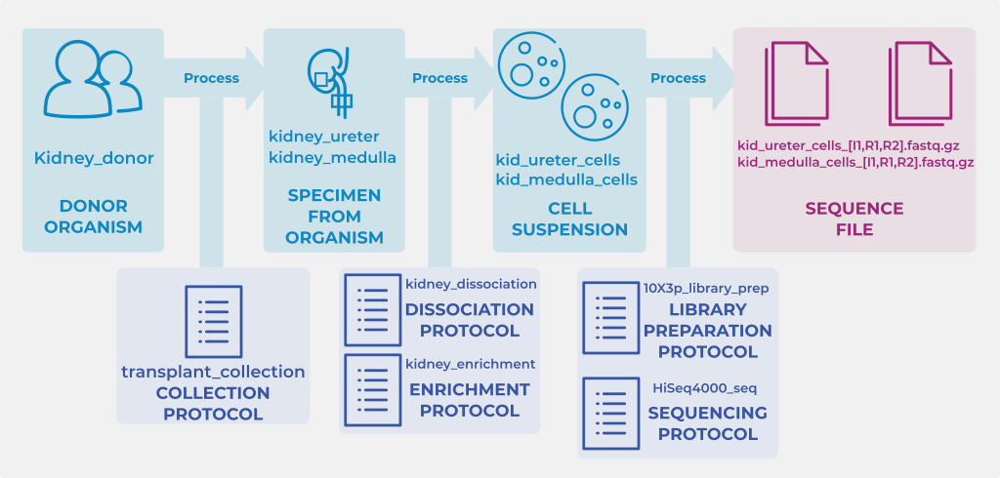

# Spreadsheet templates

## 10X template spreadsheet

[<i class="fas fa-download"></i> Download filled 10X example spreadsheet](https://github.com/ebi-ait/hca-metadata-community/raw/gh-pages/assets/ssheets/filled_example_10x.xlsx){: .btn .btn-green }

[<i class="fas fa-download"></i> Download 10X empty example spreadsheet](https://github.com/ebi-ait/hca-metadata-community/raw/gh-pages/assets/ssheets/Empty_example_10x.xlsx){: .btn .btn-purple }

## SS2 template spreadsheet

[<i class="fas fa-download"></i> Download SS2 filled example spreadsheet](https://github.com/ebi-ait/hca-metadata-community/raw/gh-pages/assets/ssheets/filled_example_SS2.xlsx){: .btn .btn-green }

[<i class="fas fa-download"></i> Download SS2 empty example spreadsheet](https://github.com/ebi-ait/hca-metadata-community/raw/gh-pages/assets/ssheets/Empty_example_SS2.xlsx){: .btn .btn-purple }
